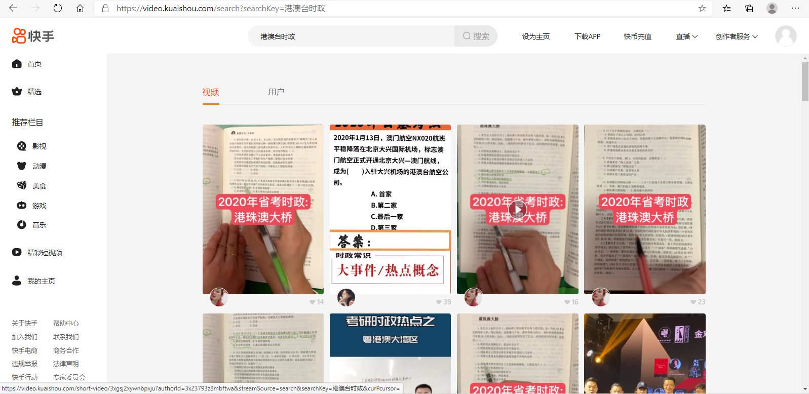
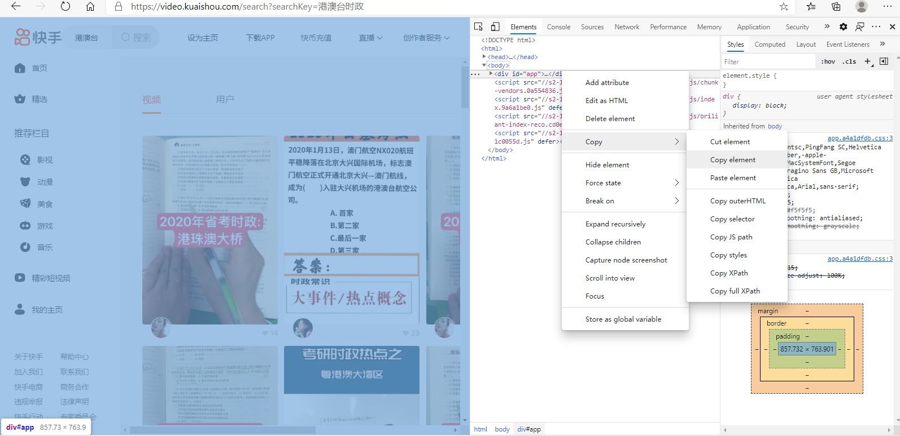
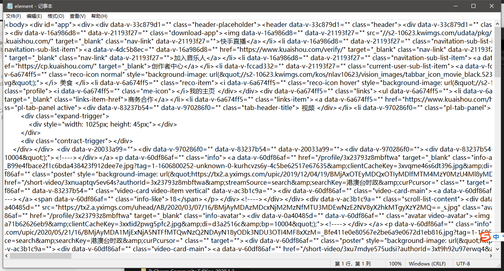

# Kwai_download
This crawler downloads Kwai short-videos by **searching a certain topic keyword**.

## User Guide

Use MS Edge or Chrome browser to open [快手 (kuaishou.com)](https://video.kuaishou.com/). 

Search a topic keyword.

Scroll down until you got enough videos.

**Note: All the videos in this page will be downloaded from top to bottom and left to right. In other words, only these videos shown in this page will be downloaded.**

Click F12 and find elements, choose ‘body’, copy and paste it into file 'element.txt', save. 

**Note: make 'element.txt' empty before you paste.**

python download.py -r \<root\>

If not specified, root is default as './\<keyword\>'. 